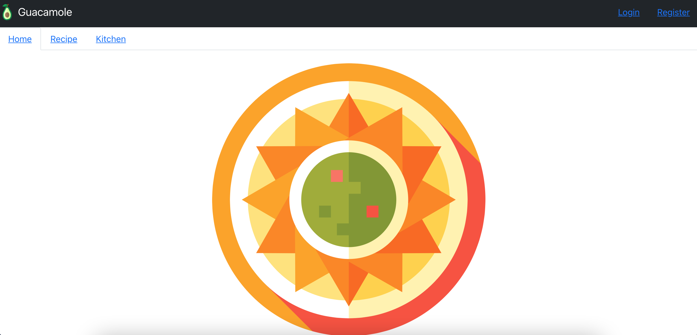
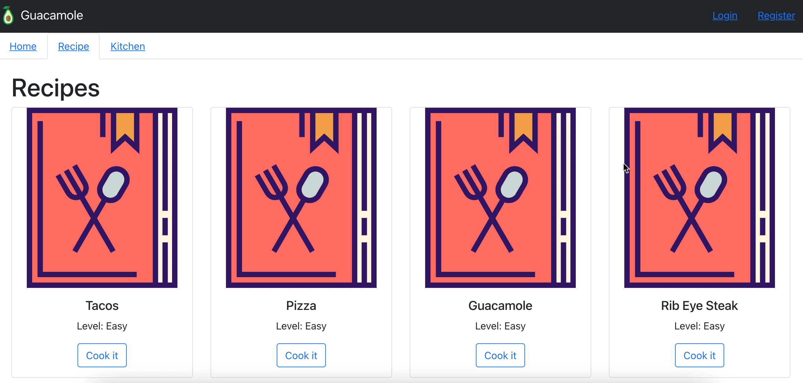
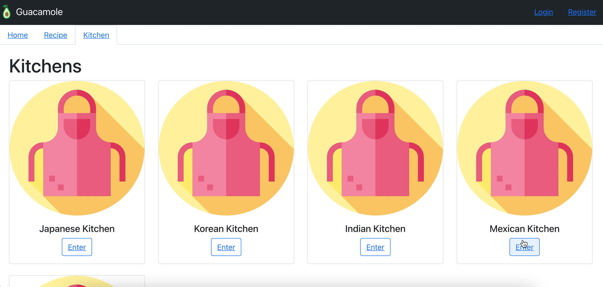
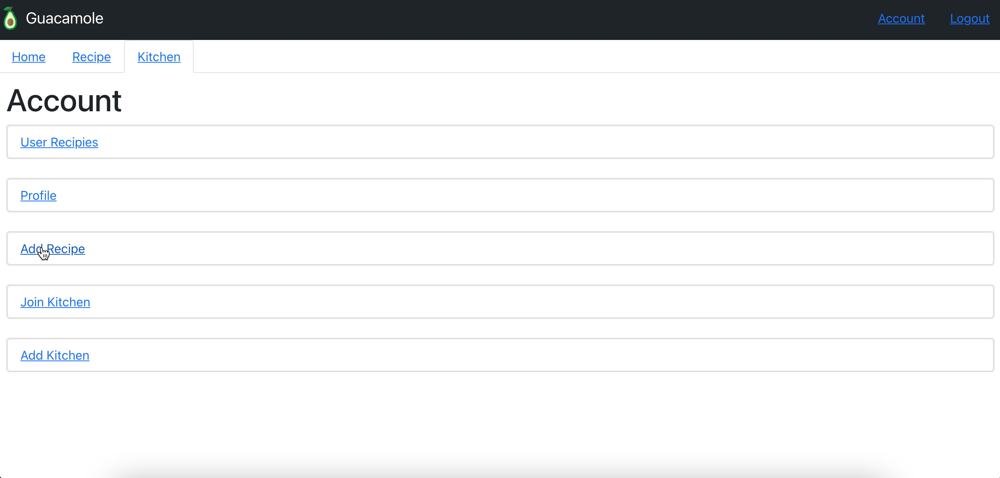
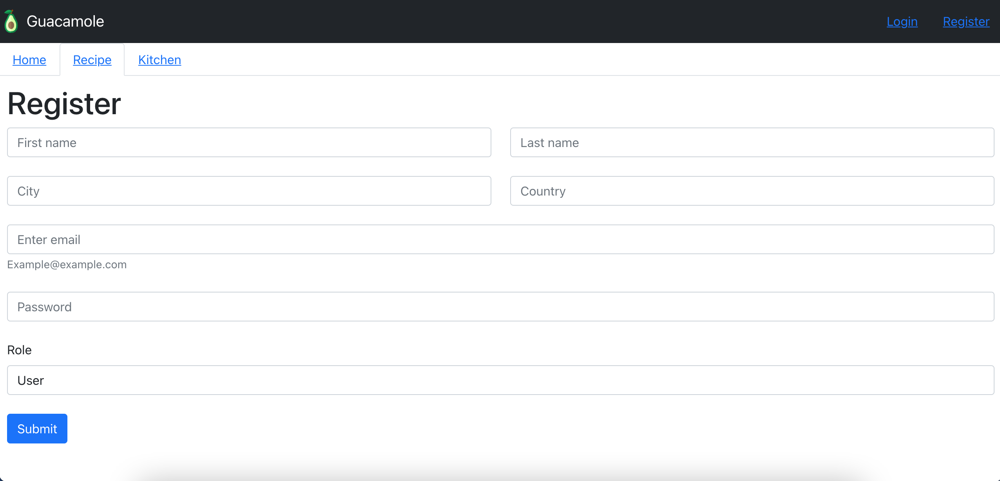
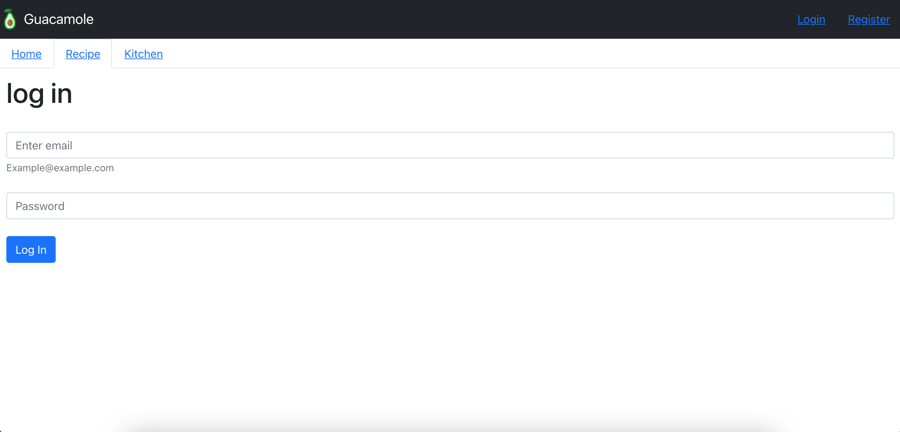
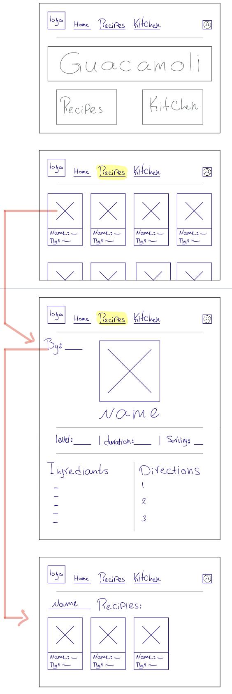
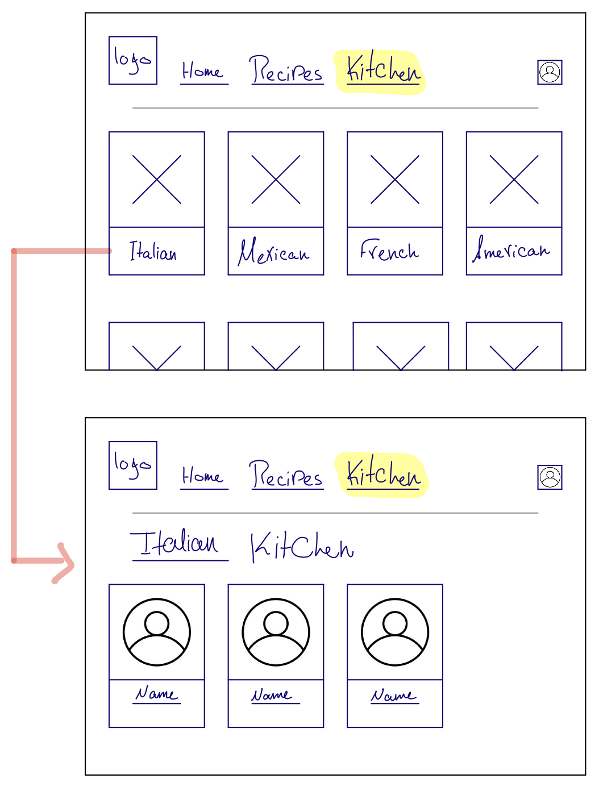
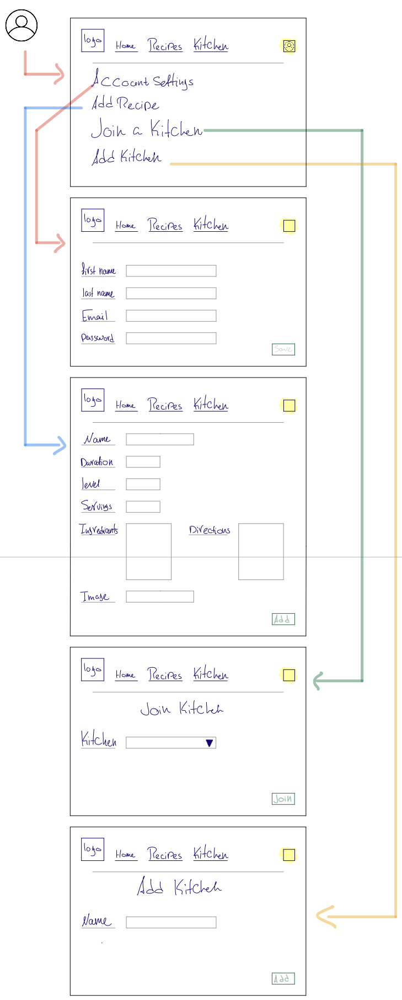
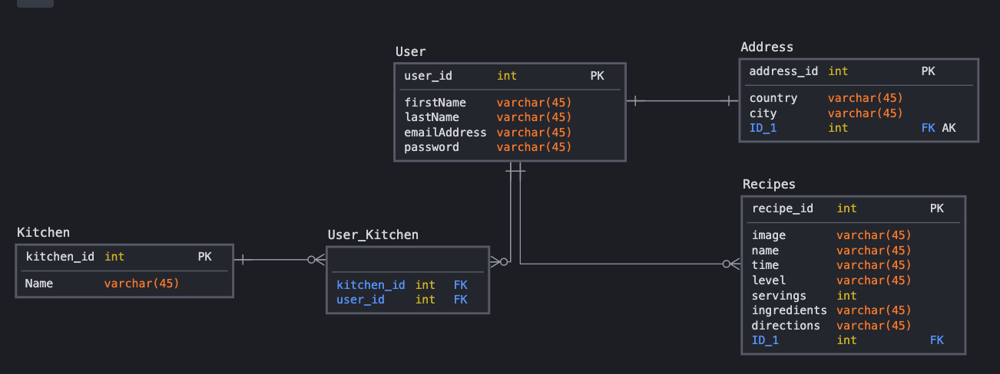

# Guacamole

Guacamole is a cooking website where the user can add a recipe and share it with the rest of the world, also the user can join a kitchen so the visitor can enter an Italian kitchen where he ca see all the Italian chefs.

## Links

* [React Repository](https://git.generalassemb.ly/mariafelemban/GuacamoleReact)
* [Eclipse Repository](https://git.generalassemb.ly/mariafelemban/GuacamoleEclipse)
* [Front-End](https://pages.git.generalassemb.ly/mariafelemban/GuacamoleReact/)
* [Back-End](http://guacamole-env.eba-mumrxm3n.us-east-2.elasticbeanstalk.com/)

## Planning Story

I broke down the project into
* Back-End without the security
* Front-End for CRUD operations
* Back-end for security
* Front-End for authentication

## User Stories

1. User

    1. As a user i want to sign in/up
    2. As a user i want to add my own recipe
    3. As a user i want to edit my own recipe
    4. As a user i want to delete my own recipe
    5. As a user i want to read other people recipes

2. Admin

    1. As an admin i want do all the CRUD operations for the recipe

    2. As an admin i want do all the CRUD operations for the kitchen

## Technologies Used

* Git
* Github
* Java - v11
* MySQL
* Spring Boot
* MVC
* React
* JWT
* axios
* Bootstrap

## Catalog of Routes

| Verb        | URI Pattern     |
| ----------- | -----------     |
| Post        | /registration   |
| Post        | /authenticate   |
| Post        | /kitchen/add    |
| Post        | /recipe/add     |
| Get         | /kitchen/index  |
| Get         | /recipe/index   |
| Get         | /recipe/detail  |
| Delete      | /kitchen/delete |
| Delete      | /recipe/delete  |
| Edit        | /kitchen/edit   |
| Edit        | /recipe/edit    |

## Unsolved Problems

* Connect the user with recipe, kitchen and address
* get user profile

## Images

### Website Screenshot

### Wireframes

### ERD

